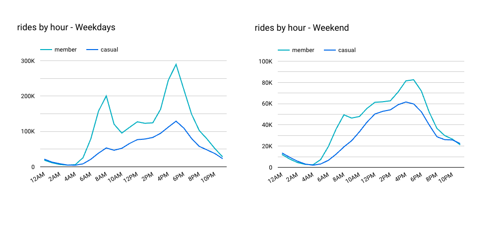
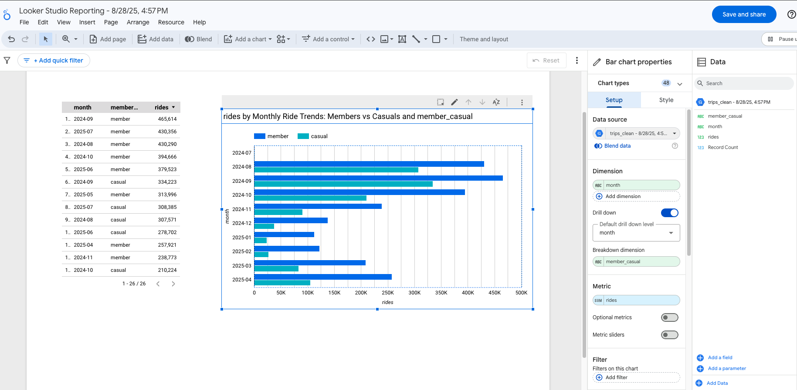
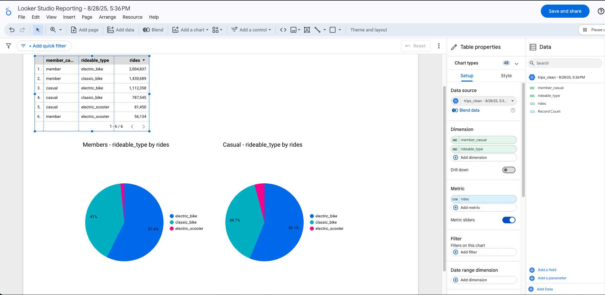

# cyclistic_casestudy_project
Cyclistic Bike Share Data Analytics Project


**Author:** Menura Thejan
**Tools:** SQL (BigQuery), Google Looker Studio, Google Cloud Storage Bucket

---

## 📌 Project Overview
Cyclistic, a fictional Chicago-based bike-share company, wants to increase **annual memberships**. This project analyzes **5.47 million rides (Aug 2024 – Jul 2025)** to compare behaviors of **casual riders vs annual members** and recommend strategies to convert casuals into members.

---

## 📊 Executive Summary
- **Casual riders**: longer rides, prefer weekends, peak midday/afternoon, seasonal.
- **Members**: shorter, more frequent rides, peak during commute hours, steady year-round.
- **E-bikes** are popular for both groups; casuals rely slightly more on them.

**Top Recommendations:**
1. Launch **Weekend-to-Weekday Trial Passes** for casuals.
2. Introduce **e-bike perks** (free unlocks/discounts) to entice casual users.
3. Build **corporate/university membership partnerships** to capture commuters.

---

## 🗂️ Data Source
- **Source:** [Divvy/Cyclistic Public Trip Data](https://divvy-tripdata.s3.amazonaws.com/index.html)
- **Period Covered:** Aug 2024 – Jul 2025
- **Volume:** 5.47 million valid rides
- **Storage:** Google Cloud Storage

---

## 🧹 Data Cleaning & Preparation
- Unioned 12 months of trip data into one dataset (`trips_all`).
- Removed:
  - Missing/invalid start or end times
  - Invalid `member_casual` values
  - Negative or >24-hour rides
- Added calculated fields: `ride_length_min`, `day_of_week`, `day_name`, `month`, `hour`, `is_weekend`.
- Final clean dataset: `trips_clean` (~5.47M rows).

---

## 🔍 Analysis & SQL Queries

### Ride Duration
```sql
SELECT
  member_casual,
  AVG(ride_length_min) AS avg_minutes,
  APPROX_QUANTILES(ride_length_min, 100)[OFFSET(50)] AS median_minutes
FROM `case-study-cyclistic-470310.cyclistic_dataset.trips_clean`
GROUP BY member_casual;
```
**Finding:** Casuals avg = 20 mins vs Members avg = 11.5 mins.

---

### Weekday vs Weekend
```sql
SELECT day_name, member_casual, COUNT(*) AS rides
FROM `case-study-cyclistic-470310.cyclistic_dataset.trips_clean`
GROUP BY day_name, member_casual
ORDER BY CASE day_name
  WHEN 'Sun' THEN 1 WHEN 'Mon' THEN 2 WHEN 'Tue' THEN 3
  WHEN 'Wed' THEN 4 WHEN 'Thu' THEN 5 WHEN 'Fri' THEN 6
  WHEN 'Sat' THEN 7 END;
```
**Finding:** Members dominate weekdays; casuals surge on weekends.

---

### Hourly Patterns (Weekday vs Weekend)
```sql
-- Weekdays
SELECT hour, member_casual, COUNT(*) AS rides
FROM `case-study-cyclistic-470310.cyclistic_dataset.trips_clean`
WHERE day_of_week BETWEEN 2 AND 6
GROUP BY hour, member_casual;

-- Weekends
SELECT hour, member_casual, COUNT(*) AS rides
FROM `case-study-cyclistic-470310.cyclistic_dataset.trips_clean`
WHERE day_of_week IN (1,7)
GROUP BY hour, member_casual;
```
**Finding:** Members show commute peaks (8AM, 5PM); casuals peak afternoons/weekends.

---

### Monthly Seasonality
```sql
SELECT month, member_casual, COUNT(*) AS rides
FROM `case-study-cyclistic-470310.cyclistic_dataset.trips_clean`
GROUP BY month, member_casual
ORDER BY month;
```
**Finding:** Casual rides are highly seasonal; members remain steady.

---

### Bike Type Split
```sql
SELECT member_casual, rideable_type, COUNT(*) AS rides
FROM `case-study-cyclistic-470310.cyclistic_dataset.trips_clean`
GROUP BY member_casual, rideable_type;
```
**Finding:** E-bikes are the most popular, especially for casuals.

---

## 📈 Visualizations (Looker Studio Dashboard)
### Hourly Ride Patterns


### Weekday Distribution


### Monthly Seasonality


### Bike Type Preferences



---

## 🚀 Recommendations
1. **Weekend-to-Weekday Trial Pass** – Convert leisure riders into weekday commuters.
2. **E-Bike Member Perks** – Incentivize casual e-bike users to become members.
3. **Corporate/University Partnerships** – Bulk memberships for commuter-heavy groups.

---

## 📂 Repository Structure
```
Cyclistic-Bike-Share-Case-Study/
├── README.md          <- Project overview (this file)
├── sql/               <- Final SQL queries
├── report/            <- Executive PDF/Slide deck
├── images/            <- Screenshots of charts
```

---

## ⚠️ Limitations
- No demographic info (age, gender, etc.).
- Station data incomplete; analysis limited to ride-level.
- Weather & holidays not included but likely impact seasonality.

---
